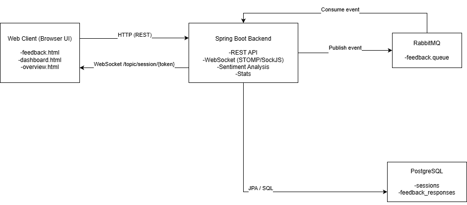
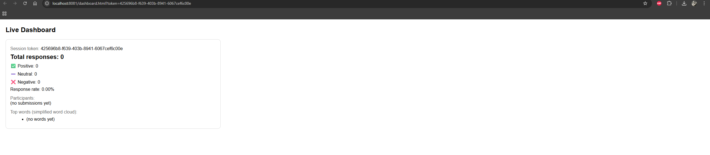
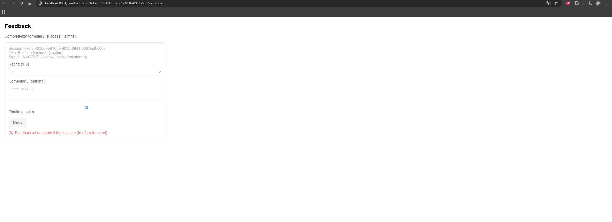
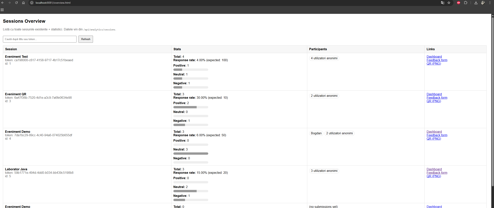
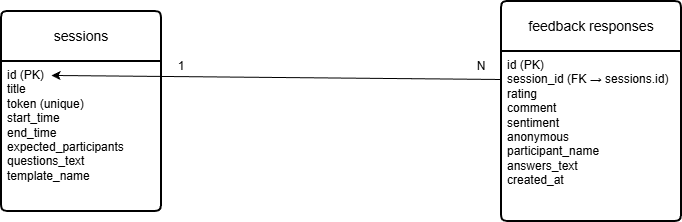

# Anonymous Feedback Collection System - SSATR IA 2025

**Student:** Bogdan Hepes

**Scenario:** 9. Anonymous Feedback Collection System

---

## Project Overview

Acest proiect implementează un sistem pentru organizatorii de evenimente / cursuri care permite:
- generarea de sesiuni de feedback cu QR codes unice,
- colectarea feedback-ului anonim sau cu nume,
- analiză de sentiment și statistici în timp real,
- vizualizare live a rezultatelor prin dashboard web,
- vizualizare comparativă a tuturor sesiunilor existente.

### Key Features

### 1 **Organizer**
- Creează sesiuni noi cu titlu, interval de timp și întrebări (template sau custom).
- Generează QR code pentru sesiune.
- Vizualizează statistici per sesiune (număr răspunsuri, rate, top cuvinte, participanți).

### 2 **Participant**
- Scanează QR și completează formularul.
- Poate trimite feedback anonim sau cu nume.
- Trimite rating, comentarii și răspunsuri la întrebări.
- Formularul se resetează după trimitere pentru ușurință.

### 3 **Dashboard & Analytics**
- Dashboard live actualizat cu RabbitMQ/WebSocket.
- Afișează total răspunsuri, breakdown pe sentiment, response rate.
- Afișează lista participanților (nume + anonimi).
- Overview cu toate sesiunile și export linkuri utile.

---

## Technology Stack

- Backend: Java + Spring Boot
- Frontend: HTML, CSS, JavaScript
- Bază de date: PostgreSQL
- Mesagerie: RabbitMQ
- WebSocket: STOMP + SockJS
- QR Code: ZXing
- Instrumente: IntelliJ IDEA, Docker
- Alte librării: Spring Web, Spring Data JPA

---

## System Architecture

### High-Level Architecture

Sistemul este construit pe o arhitectură web de tip client–server, cu suport pentru comunicare în timp real. Utilizatorii interacționează cu aplicația prin intermediul unui browser web, iar backend-ul gestionează logica aplicației, persistența datelor și actualizările live.

Arhitectura este compusă dintr-un backend central care expune API-uri REST și WebSocket, o bază de date relațională pentru stocarea informațiilor și un mecanism de mesagerie pentru propagarea evenimentelor în timp real.



**Main Components:**

1. **Web Client (Browser UI)**: Interfața utilizatorului realizată în HTML, CSS și JavaScript, care permite participanților să trimită feedback și organizerilor să vizualizeze statisticile și dashboard-ul live.

2. **Backend Application (Spring Boot)**: Componenta principală care gestionează logica aplicației, expune endpoint-uri REST pentru sesiuni și feedback, procesează analiza de sentiment și furnizează datele către dashboard prin WebSocket.

3. **Infrastructure Services (PostgreSQL & RabbitMQ)**: PostgreSQL este utilizat pentru stocarea persistentă a sesiunilor și răspunsurilor de feedback, iar RabbitMQ este folosit pentru transmiterea evenimentelor de feedback către componenta de actualizare în timp real.

### Data Flows

Datele în sistem circulă de la utilizator către backend și apoi către celelalte componente ale aplicației, fiind procesate, stocate și propagate în timp real către interfețele de vizualizare. Fluxurile de date asigură atât persistența informațiilor, cât și actualizarea live a statisticilor.

#### Data Flow 1
1. Participantul scanează codul QR și accesează formularul de feedback în browser.
2. După completarea formularului, datele sunt trimise printr-o cerere HTTP către API-ul backend.
3. Backend-ul procesează feedback-ul și publică un eveniment de tip „feedback submitted” în RabbitMQ.
4. Un consumer din backend preia mesajul din RabbitMQ, persistă datele în baza de date PostgreSQL și recalculează statisticile.
5. Backend-ul trimite o notificare în timp real prin WebSocket către dashboard-ul asociat sesiunii, actualizând vizual datele afișate.


---

### Simulations and Simplifications

Pentru realizarea acestui proiect ca proof-of-concept, anumite componente au fost simplificate sau simulate, fără a afecta demonstrarea funcționalităților de bază ale sistemului.

- Scanarea codului QR este simulată prin accesarea directă a unui link generat (URL cu token), în locul unei aplicații mobile dedicate de scanare.
- Aplicația mobilă a fost înlocuită cu o interfață web responsivă, accesibilă din browser, care îndeplinește aceleași funcții.
- Analiza de sentiment este realizată printr-un algoritm simplificat bazat pe rating și cuvinte-cheie, nu prin modele avansate de machine learning.
- Sistemul de autentificare pentru organizatori nu a fost implementat; accesul la dashboard se face direct prin token.
- Infrastructura este rulată local folosind Docker, fără configurare de medii de producție sau scalare distribuită.


## Screenshots

### Main Dashboard


Dashboard-ul principal afișează în timp real statisticile pentru o sesiune de feedback, incluzând numărul total de răspunsuri, distribuția sentimentelor (pozitiv, neutru, negativ), lista participanților și cuvintele frecvente. Datele sunt actualizate automat prin WebSocket atunci când este trimis feedback nou.

### Participant Feedback Form


Această pagină reprezintă interfața utilizatorului final. Participantul poate completa formularul de feedback accesat prin QR code, poate alege dacă trimite anonim sau cu nume și poate răspunde la întrebările configurate pentru sesiune.

### Sessions Overview


Pagina de overview afișează toate sesiunile existente în sistem, împreună cu statisticile aferente fiecăreia. Aceasta permite compararea vizuală a sesiunilor fără a selecta manual perechi de formulare.


---

## Database Schema

Baza de date utilizată este relațională (PostgreSQL) și conține tabelele principale necesare pentru gestionarea sesiunilor de feedback și a răspunsurilor participanților. Structura este simplă și optimizată pentru demonstrarea funcționalităților aplicației.

**Main Tables:**

- **sessions**  
  Tabelul `sessions` stochează informații despre fiecare sesiune de feedback creată de organizer.  
  Câmpuri principale:
    - `id` – identificator unic al sesiunii
    - `title` – titlul sesiunii
    - `token` – token unic folosit pentru accesarea formularului
    - `start_time`, `end_time` – intervalul de timp în care feedback-ul este permis
    - `expected_participants` – numărul estimat de participanți
    - `questions_text` – întrebările asociate sesiunii (template sau custom)

- **feedback_responses**  
  Tabelul `feedback_responses` stochează feedback-ul trimis de participanți.  
  Câmpuri principale:
    - `id` – identificator unic al răspunsului
    - `session_id` – referință către sesiunea asociată
    - `rating` – scor numeric (1–5)
    - `comment` – comentariu text
    - `sentiment` – sentiment calculat (POSITIVE / NEUTRAL / NEGATIVE)
    - `anonymous` – indicator pentru feedback anonim
    - `participant_name` – numele participantului (dacă nu este anonim)
    - `answers_text` – răspunsuri la întrebări
    - `created_at` – momentul trimiterii feedback-ului

**Relationships:**

- O sesiune (`sessions`) poate avea mai multe răspunsuri (`feedback_responses`).
- Fiecare răspuns de feedback aparține unei singure sesiuni (relație one-to-many).

**Diagram:**



---

## Running the Application

### Prerequisites

- Java 17 or higher
- Docker and Docker Compose
- Maven 3.8+
- IntelliJ IDEA (recommended IDE)
- Web browser (for accessing the web interface)

### Setup Instructions

1. **Clone the repository**
```bash
   git clone https://github.com/bogdanhepes/ssatr-lab-ia-hepesbogdan
   cd [project-directory]
```

2. **Start infrastructure services**
```bash
   docker-compose up -d
```

3. **Configure application**
```bash
   # Copy example configuration
   cp src/main/resources/application.properties.example src/main/resources/application.properties
   
   # Edit configuration if needed
```

4. **Build the application**
```bash
   mvn clean install
```

5. **Run the application**
```bash
   mvn spring-boot:run
```

6. **Access the application**
    - Web Interface (Participant Form): http://localhost:8081/feedback.html
    - Dashboard (Live Statistics): http://localhost:8081/dashboard.html
    - Sessions Overview: http://localhost:8081/overview.html
    - REST API Base URL: http://localhost:8081/api
    
---

## Future Improvements


- Autentificare pentru organizer
- Word cloud vizual
- Export CSV

---
